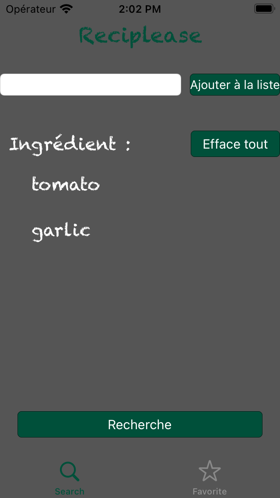
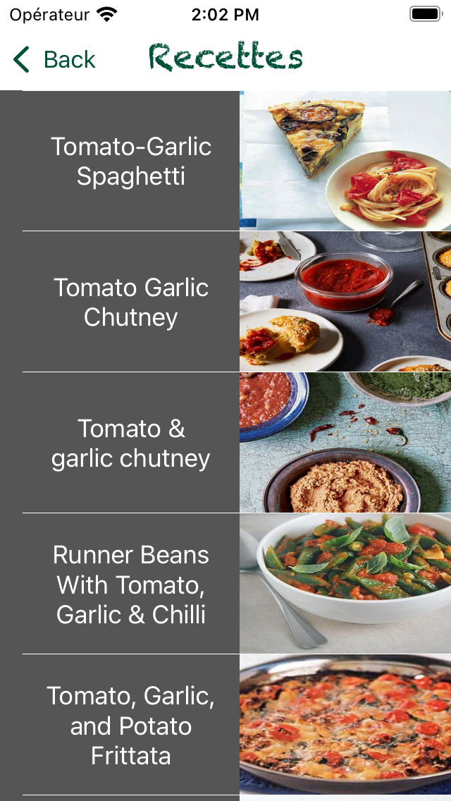
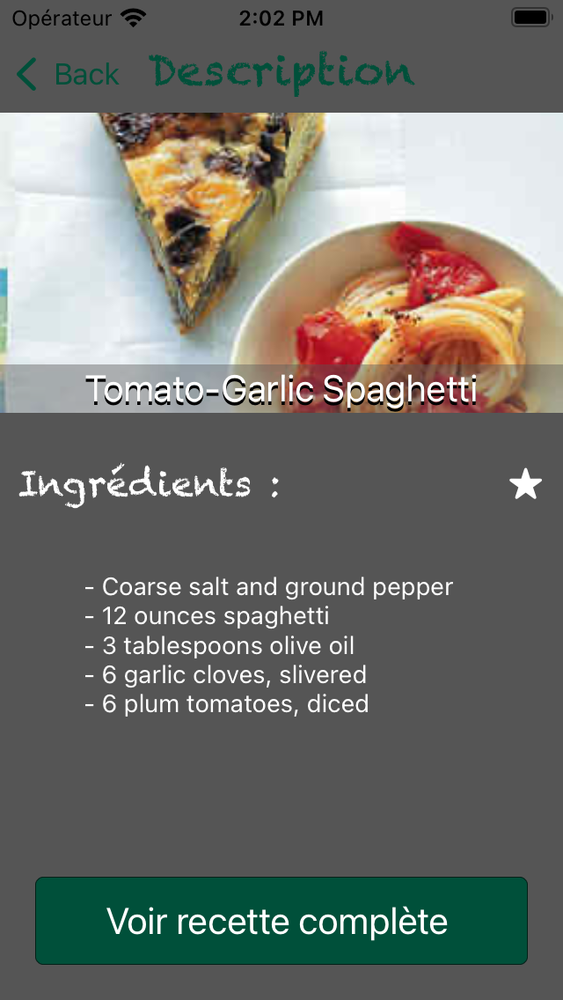
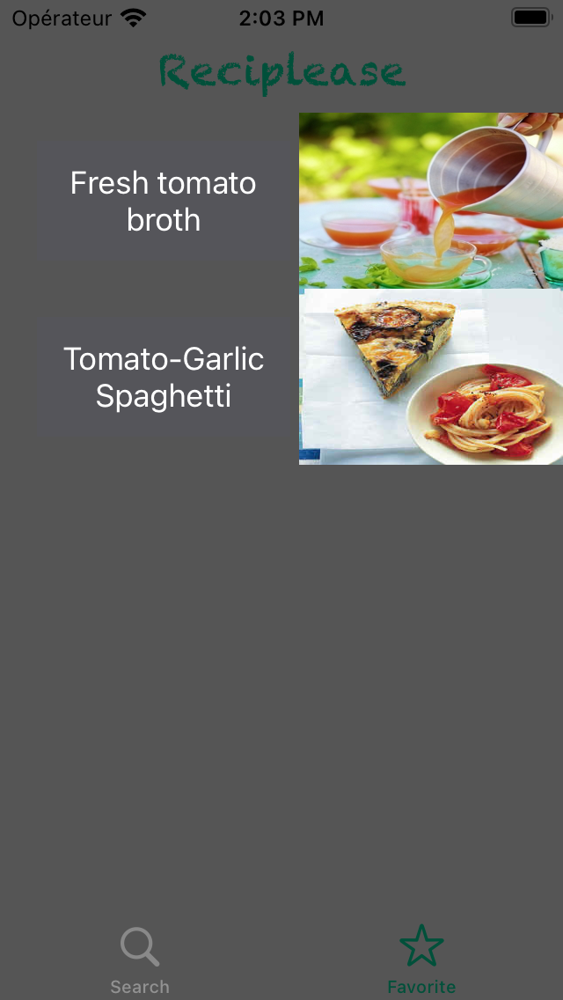

# Project 10 for OpenClass rooms

Créez l'application Reciplease... pour de bons petits plats ! 

Parcours Développeur d'application - iOS 

API key dans le git ignore -> projet fonctionnel 

 
# Reciplease

This project is for my school OpenclassRooms

The application is a exercice for learn Alamofire and Core Data

The application is used to :  
- Insert the aliments in the fridge  
- Find recipe for the aliments  
- Watch the recipe details  
- Save in favorite the best recipes  

 

